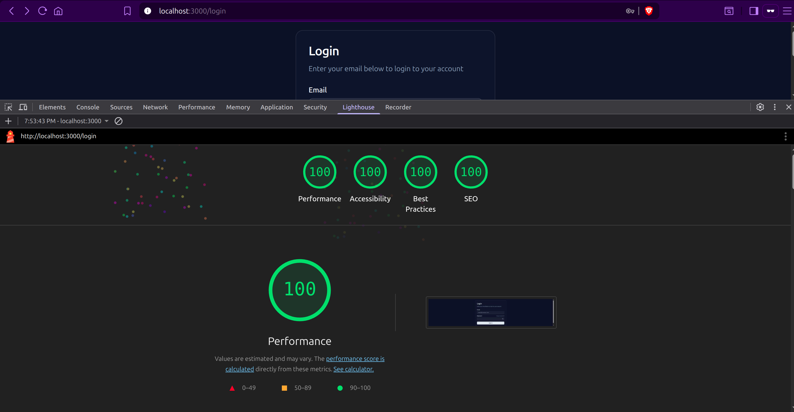

# 🚀 Super Next.js 16 Enterprise Boilerplate

> **Engineered, not generated.**\
> **Handcrafter, not vibe coded.**

> A production-grade foundation built on Next.js 16, React 19, React compiler and Tailwind v4. Designed for performance, strict type safety, and scalability.

   

## 💎 Why This Boilerplate?

This project is **hand-crafted by experienced engineer** to solve real-world production problems:

- **Zero-Bundle Layouts:** Layouts render entirely on the server. Zero JavaScript sent to the client for the shell.
- **The "Hybrid" Network Layer:**
  - **Server Actions** for Mutations (Auth, Forms) -> No Client JS, HttpOnly Cookies.
  - **TanStack Query** for Data Fetching (Lists, Tables) -> Caching, Deduplication.
- **Strict Architecture:** Feature-Sliced Design (Vertical Slices) prevents "Spaghetti Code" as the app grows to 100k+ lines.
- **100% Lighthouse Score:** Optimized images, fonts, accessibility landmarks, and scalable viewports out of the box.

## 🏆 Performance Benchmarks

We don't just talk about performance; we measure it.
Achieved **100/100** scores on Lighthouse (Mobile) with strict accessibility standards.



---

## 🛠 Tech Stack

- **Framework:** Next.js 16 (App Router + Turbopack)
- **Core:** React 19 (Server Components + Actions)
- **Styling:** Tailwind CSS v4 (OKLCH Colors + `@theme` directives)
- **UI Library:** Shadcn UI (Canary / R19 Compatible)
- **Validation:** Zod (Shared Schemas for Client/Server)
- **Testing:** Vitest (Unit/Component) + Playwright (E2E)
- **Quality:** ESLint (Strict), Prettier (Sorted), Husky (Git Hooks)

---

## 📂 Architecture: Feature-Sliced Design

We abandoned the traditional `components/` vs `pages/` mess. We use **Vertical Slices** where everything related to a feature lives together.

```text
src/
├── api/                      # 🌍 Network Layer (Centralized)
│   ├── client.ts             # Type-safe Fetch Wrapper
│   ├── endpoints.ts          # API URL Registry
│   └── server-wrapper.ts     # Action Logger & Error Handler
│
├── features/                 # 📦 Vertical Slices (The Brain)
│   └── auth/
│       ├── actions/          # Server Actions (Controllers)
│       ├── components/       # Feature-specific UI
│       ├── schemas/          # Zod Schemas
│       └── types/            # TypeScript Definitions
│
├── components/               # 🧩 Global Shared UI
│   ├── ui/                   # Shadcn Primitives (Dumb)
│   └── layouts/              # App Shells
│
└── proxy.ts                  # 🛡️ Edge Middleware (Route Protection)
```

---

## ⚡ Developer Experience (DX)

We enforce quality so you don't have to argue about it in Code Reviews.

### 1. The "Smart" Server Action Hook

We don't use raw `useActionState`. We use a custom hook that:

- Auto-toasts Success/Error messages.
- **Logs detailed network payloads to the Browser Console** (mimicking the Network Tab for Server Actions).

```tsx
// Inside any component
const [state, action, isPending] = useServerAction(loginAction);
```

### 2. Strict Linting Rules

- **No Arrow Components:** Forces `function ComponentName() {}` for better stack traces.
- **No Relative Imports:** Forces `@/components/...` for cleaner refactoring.
- **Type Safety:** Strict `unknown` error handling in try/catch blocks.

---

## 🚀 Getting Started

This project enforces `pnpm` to prevent dependency hoisting issues.

```bash
# 1. Install Dependencies
pnpm install

# 2. Setup Environment
cp .env.example .env.local
# (Fill in NEXT_PUBLIC_API_URL)

# 3. Run Development Server
pnpm dev
```

## 🧪 Testing Strategy

We use a "Trophy" testing strategy.

### Unit & Component Tests (Vitest)

Tests logic, Zod schemas, and UI accessibility/state.

```bash
pnpm test
```

### End-to-End Tests (Playwright)

Tests the **Real** flows: Middleware redirects, Cookie setting, and full Login flows against the API.

```bash
pnpm e2e
```

---

## 🛡️ Authentication Flow

1.  **Form Submission:** Uses React 19 `action` prop.
2.  **Server Action:** Validates Zod -> Calls External API -> Sets `HttpOnly` Cookies.
3.  **Redirect:** Uses highly optimized Server-Side `redirect()` (Status 303) for instant navigation.
4.  **Protection:** `proxy.ts` (Middleware) checks cookies on Edge to protect `/dashboard`.

---

## 🤝 Contribution Guidelines

1.  **No `any` types.** Ever.
2.  **Server Components first.** Only use `"use client"` when interactivity is required.
3.  **Colocation.** Keep styles, tests, and logic near the component using them.

---

_Hand-crafted with obsession for quality._
